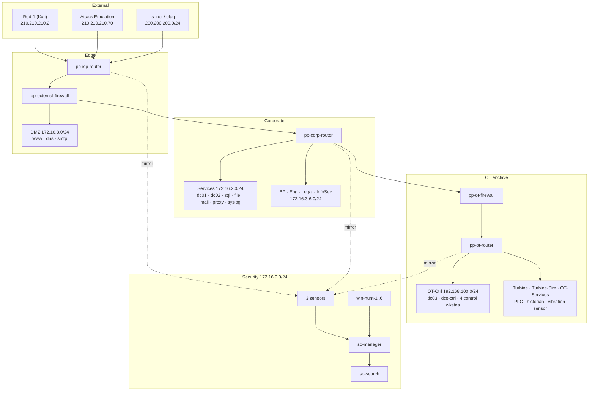

# ss-pp-so — Range Reference

Technical reference for the `voltgrid.com` power-utility range: topology,
telemetry coverage, deployment procedure and verification.

Audience: range operators and instructors. Assumes working knowledge of
Security Onion, Active Directory and Ansible.

Scope: this document covers the range as built by `ss-pp-so`. Splunk is
deployed here but out of scope pending the Splunk/Security Onion integration
work.

---

## At a glance

| | |
|---|---|
| **Hosts** | 75 |
| **AD forest** | `voltgrid.com`, three domain controllers, 40 domain members |
| **Corporate segments** | Services, Business Processing, Engineering, Legal, InfoSec |
| **OT enclave** | Four segments behind a dedicated firewall — control, turbine, turbine-sim, OT services |
| **SIEM** | Security Onion 2.4 distributed — manager, search node, three sensors |
| **Network visibility** | Three GRE `gretap` mirrors covering corporate, OT and the attack path |
| **Endpoint visibility** | Elastic Agent on Windows and Linux hosts, enrolled into SO's Fleet |
| **Analyst positions** | Six dedicated hunt workstations on the security segment |
| **Attack sources** | Red-1 (Kali) for manual operations, SimSpace attack emulation for automated |
| **User activity** | 32 emulated users generating background traffic across the corporate segments |

---

## Design constraints

Four properties of the build determine what practitioners can and cannot see.
They are stated here because several downstream behaviours only make sense
against them.

**Sensor coverage is positional.** Each sensor receives a mirror from exactly
one router, so an event is visible only to the sensor whose router carries it.
red-net traffic reaches `so-sensor-edge` alone; corporate traffic reaches
`so-sensor-corp`; OT traffic reaches `so-sensor-ot`. There is no aggregation
tap. Correlating an intrusion across segments requires correlating across
sensors.

**The OT enclave is segmented at layer 3.** `pp-ot-firewall` is the boundary and
OT reaches corporate over static routes only. `pp-dc03` sits inside the enclave
so OT hosts authenticate locally, which means routine identity traffic does not
cross the boundary.

**Endpoint telemetry is not uniform.** 42 of 45 Windows hosts run Sysmon. The
three exclusions are deliberate and documented in `hosts`.

**The network is not quiet.** 32 emulated users generate browsing, file and
process activity continuously across the corporate segments. Detection logic
that depends on a low-noise baseline will not behave as it does in a lab.

---

## Network architecture



### Segments

| Segment | CIDR | Contents |
|---|---|---|
| Services | 172.16.2.0/24 | `pp-dc01`, `pp-dc02`, `pp-sql`, `pp-file`, `pp-mail`, `pp-proxy`, `pp-syslog` |
| Business Processing | 172.16.3.0/24 | 8 workstations |
| Engineering | 172.16.4.0/24 | 8 workstations |
| Legal | 172.16.5.0/24 | 6 workstations |
| InfoSec | 172.16.6.0/24 | 4 workstations |
| DMZ | 172.16.8.0/24 | `pp-www`, `pp-dmz-dns`, `pp-dmz-smtp` |
| Security | 172.16.9.0/24 | SO grid, 6 hunt workstations, 3 forensics VMs |
| OT-Ctrl | 192.168.100.0/24 | `pp-dc03`, `pp-dcs-ctrl`, `pp-ctl-wks-01..04` |
| Gas-Turbine | 192.168.95.0/24 | Plant equipment |
| Gas-Turbine-Sim | 192.168.90.0/27 | Simulation |
| OT-Services | 192.168.90.96/27 | PLC, historian, vibration sensor, engineering workstation |
| Internet (sim) | 200.200.200.0/24 | `is-inet`, `elgg` |
| red-net | 210.210.210.0/24 | `Red-1`, Activity-Emulation |

### Routing

| Domain | Protocol | Notes |
|---|---|---|
| Corporate core | OSPF area 0 | Enabled per-interface on `pp-corp-router`, `pp-internal-router`, `site-edge-router` and the pfSense firewalls |
| ISP edge | eBGP | `pp-external-firewall` (AS 65001) to `pp-isp-router` (AS 65002) — the only BGP session in the fabric |
| OT enclave | Static | `pp-ot-firewall` is the boundary; corporate reaches `192.168.0.0/16` via static route, OT reaches corporate via default |

The three pfSense firewalls run FRR. `pp-external-firewall` redistributes OSPF
into BGP but **not** connected routes, which keeps the management plane out of
the ISP-facing advertisement.

---

## Active Directory

`voltgrid.com`, single forest, three domain controllers:

| DC | Address | Placement |
|---|---|---|
| `pp-dc01` | 172.16.2.7 | Primary, Services segment |
| `pp-dc02` | 172.16.2.8 | Additional, Services segment |
| `pp-dc03` | 192.168.100.5 | Additional, **inside the OT enclave** |

`pp-dc03` is the interesting one. The OT control workstations authenticate
against a DC that lives on their side of the firewall, so OT identity traffic
does not routinely cross the boundary — which means when it *does*, that is a
signal.

40 hosts are domain members. Workstations run **emulated users** with real
identities (`charity.bowen`, `ahmed.ortega`, `david.miller` and 29 others) who
log in, browse, open documents and generate the background traffic that makes
detection non-trivial.

---

## The OT enclave

Four segments behind `pp-ot-firewall`, gatewayed by `pp-ot-router`:

- **OT-Ctrl** — `pp-dcs-ctrl` (the DCS control station) and four control
  workstations, plus `pp-dc03`.
- **Gas-Turbine**, **Gas-Turbine-Sim**, **OT-Services** — plant equipment:
  a PLC, a process historian, a vibration sensor, an engineering workstation.

The plant devices are **unmanaged** — they arrive pre-configured from their
images and Ansible does not touch them, exactly as real plant equipment behaves
under a corporate config-management regime.

`pp-dcs-ctrl`, the DCS control station, forwards Windows event logs but runs
**no Sysmon**, deliberately. The line is *instrument versus observe*: Sysmon
instruments the OS with a kernel driver and process-level hooks, which does not
belong on process-critical equipment, while a log forwarder only reads what
Windows already writes. That is how conservative OT programmes actually behave.

Practical consequence: on `pp-dcs-ctrl` you have Windows event data — logons,
account use, service installs — and network evidence from `so-sensor-ot`, but
no process tree and no Sysmon network or DNS events. Activity on that host must
be reconstructed from those two sources.

---

## Security Onion

Distributed 2.4 grid on the security segment:

| Node | Address | Role |
|---|---|---|
| `so-manager` | 172.16.9.30 | Manager, SOC web interface, Fleet |
| `so-search` | 172.16.9.35 | Search node |
| `so-sensor-corp` | 172.16.9.40 | Corporate traffic |
| `so-sensor-ot` | 172.16.9.41 | OT traffic |
| `so-sensor-edge` | 172.16.9.42 | Attack path and Internet |

### What each sensor sees

### Mirror implementation

Traffic is copied from router interfaces into `gretap` tunnels with `tc mirred`.

| Property | Value |
|---|---|
| Encapsulation | `gretap` (layer 2) — Zeek's AF_PACKET plugin requires Ethernet frames; a layer-3 `gre` tunnel yields `DLT_RAW` and produces zero connection logs while Suricata continues to alert |
| Tunnel MTU | 1462 — 1500 less 20 (outer IP), 4 (GRE), 14 (inner Ethernet) |
| Mechanism | `tc` ingress and root `prio` qdiscs per source interface, `matchall action mirred egress mirror dev tun0` |
| Persistence | `/config/scripts/vyatta-postconfig-bootup.script`, re-applied at boot |
| Exclusions | `10.255.240.0/20` passed on src and dst ahead of the mirror |

The management plane shares a data-plane interface on these routers, so each
mirrored interface carries two `action pass` filters at lower priority than the
`mirred` catch-all. On `pp-corp-router` that keeps the Services subnet
(`pp-dc01`, `pp-dc02`, `pp-sql`, `pp-file`, `pp-mail`) in coverage while
excluding orchestration traffic that does not exist in-scenario.

Verify with the absolute path — `tc` is not on the `vyos` user's PATH, and a
bare invocation returns "command not found" that a counting grep renders
indistinguishable from "no filters":

```
/sbin/tc filter show dev eth0 ingress
```

Expect one `mirred` filter and two `action pass` filters per source interface.

| Sensor | Mirrors | Coverage |
|---|---|---|
| `so-sensor-corp` | `pp-corp-router` eth0–eth4 | Services, Business Processing, Engineering, Legal, InfoSec |
| `so-sensor-ot` | `pp-ot-router` eth1–eth4 | Gas-Turbine, Gas-Turbine-Sim, OT-Services, OT-Ctrl |
| `so-sensor-edge` | `pp-isp-router` eth1–eth2 | red-net and the simulated Internet |

**Management traffic is excluded.** On these routers the management IP shares a
data-plane interface, so the mirror carries `action pass` rules for
`10.255.240.0/20` ahead of the catch-all. Practitioners never see the
orchestration plane, which does not exist in-scenario.

Because each sensor is fed by exactly one router, sensor identity is a location
signal: an event present on `so-sensor-ot` and absent from `so-sensor-corp`
indicates traffic that did not cross the OT boundary. There is no aggregation
point, so cross-segment activity must be correlated across sensors rather than
read from a single stream.

### Endpoint telemetry

Elastic Agents on Windows and Linux endpoints enrol into SO's Fleet, so process
and file activity sits alongside network evidence. **Sysmon runs on 42 of the
45 Windows hosts**, driven by the `[sysmon]` inventory group. Three are
excluded on purpose: `pp-dcs-ctrl` for the reason below, and `pp-dmz-dns` and
`pp-dmz-smtp`, which sit outside the forest and outside the corporate telemetry
contract.

Coverage is a group rather than a host pattern so that "does this host produce
endpoint telemetry" is a decision someone recorded, not a side effect of who
happens to run emulated users.

### Access

SOC web interface: **`https://172.16.9.30`**

Reach it from a hunt workstation. SOC is configured for IP access, so there is
no hostname to resolve.

---

## The analyst environment

Six Windows 10 workstations on the security segment — `win-hunt-1` through
`win-hunt-6`, `172.16.9.11–16` — with Chrome and autologin, positioned to reach
the SOC interface directly.

They are **not** in the `[aue]` group and run no emulated users, so analyst
activity is not mixed with synthetic user activity on the hosts analysts work
from.

They do carry Sysmon and a log forwarder. An attacker who reaches an analyst
workstation sees everything the SOC sees and can steer the investigation, so
those hosts are monitored like any other endpoint.

---

## Forensics and malware analysis tooling

Three analyst VMs on the security segment:

| Host | Address | Purpose | Telemetry |
|---|---|---|---|
| `pp-sift` | 172.16.9.101 | SANS Investigative Forensic Toolkit — disk and memory analysis | none currently; a candidate for enrolment |
| `pp-remnux` | 172.16.9.100 | Malware analysis (Linux) | **none, deliberately** |
| `pp-flare` | 172.16.9.102 | Malware analysis (Windows) | **none, deliberately** |

All three are in `[forensics]`, a label group no play targets. `pp-remnux` and
`pp-flare` are additionally in `[unmanaged]`, which is what excludes them from
`75-endpoint.yml`.

**Why the detonation hosts are not instrumented.** Sysmon and Elastic Agent on
a box whose purpose is executing malware emit process trees, network
connections and file writes indistinguishable from an intrusion — because they
are one, just an authorised one. Enrolling them would feed instructor activity
into the SIEM students are hunting in, producing the most convincing false
positives available. `pp-sift` is the opposite case: it analyses evidence,
executes nothing hostile, and holds the investigation's work product, which
makes it a target worth monitoring. It is not enrolled yet — see `hosts` for
the three prerequisites.

### Adjacency — read before running live samples

`pp-remnux` and `pp-flare` share layer 2 with `so-manager`, `so-search`, all
three sensors, `pp-splunk` and the six hunt workstations. A sample with
worm-like behaviour reaches every one of them **without traversing a router**,
so no firewall rule or routing change constrains it.

This is acceptable for static analysis — strings, unpacking, disassembly,
memory forensics — which is how these hosts are expected to be used. It is
**not** acceptable for uncontrolled detonation. If live execution becomes part
of exercise design, the correct fix is a dedicated analysis subnet behind
`pp-internal-firewall` with no path to `pp-security`; nothing short of a
separate segment contains same-subnet propagation.

Note also that the security segment is not a `vyos_mirror` source, so no sensor
captures traffic on it. Activity between these hosts and the SO grid is
invisible at the network layer.

---

## Generating attacks

Two sources, usable independently or together.

**Red-1** — a Kali desktop on red-net at `210.210.210.2`, for manual red team
work. Everything it does crosses `pp-isp-router` and is therefore carried by
`so-sensor-edge` on its way in.

**Attack emulation** — SimSpace's platform driving scripted activity against
the `[ae]` hosts: `pp-dc01`, `pp-dc02`, `pp-dc03`, `pp-file`, `pp-sql`,
`pp-mail`, `pp-dcs-ctrl`. Note the mix — two corporate DCs, the file and
database servers, mail, and the OT control station. The target set spans the
firewall boundary on purpose.

Both paths produce telemetry through the same sensors and the same Fleet
agents, so a scenario can begin automated and continue manually without the
defender's view changing shape.

---

## Standing the range up

```
cd /etc/ansible
wget -q -O ab_pp.tgz <tarball URL for the pinned commit>
tar -xzf ab_pp.tgz
sudo ./deploy.sh
```

`deploy.sh` makes three attempts: a full run, then failed hosts only, then a
full run again. Several steps depend on state another host reaches
asynchronously, so a first-attempt failure is often ordering rather than fault.

Expect **two to three hours** for a full build from a fresh blueprint. The
Security Onion manager install alone is 20–30 minutes and the search and sensor
installs 5–10 each.

### Verifying

```
sudo ./verify_so.sh -v          # Security Onion grid
sudo ./verify_deployment.sh     # range-wide
```

`verify_so.sh` prints its own totals. **The number that matters is Fail: 0.**

Then confirm the thing that most often fails silently — that sensors are
*seeing traffic*, not merely running:

```
sudo ansible so-sensor-corp,so-sensor-edge,so-sensor-ot -b -m shell \
  -a 'timeout 10 tcpdump -i tun0 -c 20 2>&1 | tail -3'
```

A sensor with Suricata alerting and Zeek producing zero connection logs means
the tunnel is carrying the wrong frame type. Both ends must be `gretap`.

---

## What healthy looks like

| Check | Expected |
|---|---|
| `so-status` on every SO node | all services running |
| Elastic cluster | green, search node present |
| `tcpdump -i tun0` on each sensor | packets flowing |
| Zeek `conn.log` | connection records, not zero |
| Fleet | every endpoint enrolled |
| Domain membership | 40 hosts joined to `voltgrid.com` |

---

## Known behaviours

Things that look like faults and are not.

**SOC health-check failures fetching detection content.** SOC tries to reach
GitHub every five minutes for rule updates, AI summaries and playbooks. The
range has no egress, so these fail continuously. Detection on ingested data is
unaffected.

**A `SA-cim_vladiator` export warning.** Cosmetic, and the app ships that way
deliberately.

**Emulated user noise.** 32 users producing browsing, file and process activity
is intentional. Detections that only work on a quiet network are not
detections.

**Gateway ARP repair messages during deploy.** `INIT_GW_REPAIRED_AND_PINNED` in
the run output is the platform-level ARP fault being caught and corrected
before it can break routing. Seeing it is good; it means the guard is working.

---

## Credentials

> Passwords are stored in `group_vars/all/vault.yml` (Ansible Vault). The
> values below are the current range defaults. **Rotate them before any
> deployment that is not a lab.**

| System | Access | Username | Password |
|---|---|---|---|
| Security Onion SOC | `https://172.16.9.30` | `admin@voltgrid.com` | `Simspace1!Simspace1!` |
| Domain admin | `voltgrid.com` | `simspace` | `Simspace1!Simspace1!` |
| Domain users | `voltgrid.com` | see emulated identities | `Simspace1!Simspace1!` |
| Windows servers | RDP / WinRM | `simspace` | `Simspace1!Simspace1!` |
| Windows 10/11 workstations | RDP / WinRM | `xadmin` | `ConfigingInTheNameOf1!` |
| Linux hosts | SSH | `simspace` | `simspace1` |
| pfSense firewalls | SSH / web | `admin` | `simspace1` |
| VyOS routers | SSH | `vyos` | `Simspace1!` |
| SO node join secret | — | — | `Simspace1!Simspace1!` |

Analyst workstations `win-hunt-1..6` autologin, so a practitioner sitting at
one has a desktop without needing credentials.

Workstation and server credentials differ — the workstation images ship a
different local account. Using the wrong one does not fail fast; it retries
until timeout and looks like an unbooted host.

---

## Appendix — full host inventory

| Host | Address | Segment | Function |
|---|---|---|---|
| `Activity-Emulation` | 210.210.210.70 | red-net | workstation / member |
| `Red-1` | 210.210.210.2 | red-net | workstation / member |
| `ansible` | 10.10.10.10 | — | ansible_controller |
| `elgg` | 200.200.200.205 | Internet (sim) | unmanaged |
| `is-inet` | 200.200.200.2 | Internet (sim) | email |
| `pp-bp-wkstn-1` | 172.16.3.10 | Business Processing | workstation / member |
| `pp-bp-wkstn-2` | 172.16.3.3 | Business Processing | workstation / member |
| `pp-bp-wkstn-3` | 172.16.3.4 | Business Processing | workstation / member |
| `pp-bp-wkstn-4` | 172.16.3.5 | Business Processing | workstation / member |
| `pp-bp-wkstn-5` | 172.16.3.6 | Business Processing | workstation / member |
| `pp-bp-wkstn-6` | 172.16.3.7 | Business Processing | workstation / member |
| `pp-bp-wkstn-7` | 172.16.3.8 | Business Processing | workstation / member |
| `pp-bp-wkstn-8` | 172.16.3.9 | Business Processing | workstation / member |
| `pp-corp-router` | 172.16.2.1 | Services | vyos |
| `pp-ctl-wks-01` | 192.168.100.101 | OT-Ctrl | ot_control |
| `pp-ctl-wks-02` | 192.168.100.102 | OT-Ctrl | ot_control |
| `pp-ctl-wks-03` | 192.168.100.103 | OT-Ctrl | ot_control |
| `pp-ctl-wks-04` | 192.168.100.104 | OT-Ctrl | ot_control |
| `pp-dc01` | 172.16.2.7 | Services | pdc |
| `pp-dc02` | 172.16.2.8 | Services | additional_dc |
| `pp-dc03` | 192.168.100.5 | OT-Ctrl | additional_dc |
| `pp-dcs-ctrl` | 192.168.100.10 | OT-Ctrl | ot_servers |
| `pp-dmz-dns` | 172.16.8.4 | DMZ | dmz |
| `pp-dmz-smtp` | 172.16.8.3 | DMZ | dmz |
| `pp-eng-wkstn-1` | 172.16.4.10 | Engineering | workstation / member |
| `pp-eng-wkstn-2` | 172.16.4.3 | Engineering | workstation / member |
| `pp-eng-wkstn-3` | 172.16.4.4 | Engineering | workstation / member |
| `pp-eng-wkstn-4` | 172.16.4.5 | Engineering | workstation / member |
| `pp-eng-wkstn-5` | 172.16.4.6 | Engineering | workstation / member |
| `pp-eng-wkstn-6` | 172.16.4.7 | Engineering | workstation / member |
| `pp-eng-wkstn-7` | 172.16.4.8 | Engineering | workstation / member |
| `pp-eng-wkstn-8` | 172.16.4.9 | Engineering | workstation / member |
| `pp-engws` | — | — | unmanaged |
| `pp-external-firewall` | 10.255.240.191 | — | pfsense |
| `pp-file` | 172.16.2.3 | Services | file |
| `pp-flare` | 172.16.9.102 | Security | forensics |
| `pp-gas-sim` | — | — | unmanaged |
| `pp-gasplant-plc` | — | — | unmanaged |
| `pp-gasvibsens` | — | — | unmanaged |
| `pp-internal-firewall` | 10.255.240.197 | — | pfsense |
| `pp-internal-router` | 172.16.9.1 | Security | vyos |
| `pp-is-wkstn-1` | 172.16.6.10 | InfoSec | workstation / member |
| `pp-is-wkstn-2` | 172.16.6.3 | InfoSec | workstation / member |
| `pp-is-wkstn-3` | 172.16.6.4 | InfoSec | workstation / member |
| `pp-is-wkstn-4` | 172.16.6.5 | InfoSec | workstation / member |
| `pp-isp-router` | 75.21.1.2 | ISP | vyos |
| `pp-ls-wkstn-1` | 172.16.5.10 | Legal | workstation / member |
| `pp-ls-wkstn-2` | 172.16.5.3 | Legal | workstation / member |
| `pp-ls-wkstn-3` | 172.16.5.4 | Legal | workstation / member |
| `pp-ls-wkstn-4` | 172.16.5.5 | Legal | workstation / member |
| `pp-ls-wkstn-5` | 172.16.5.6 | Legal | workstation / member |
| `pp-ls-wkstn-6` | 172.16.5.7 | Legal | workstation / member |
| `pp-mail` | 172.16.2.5 | Services | workstation / member |
| `pp-ot-firewall` | 10.255.240.190 | — | pfsense |
| `pp-ot-hist` | — | — | unmanaged |
| `pp-ot-router` | 192.168.200.202 | — | vyos_routes_only |
| `pp-proxy` | 172.16.2.20 | Services | proxy |
| `pp-remnux` | 172.16.9.100 | Security | forensics |
| `pp-sift` | 172.16.9.101 | Security | forensics |
| `pp-splunk` | 172.16.9.20 | Security | workstation / member |
| `pp-sql` | 172.16.2.4 | Services | workstation / member |
| `pp-syslog` | 172.16.2.9 | Services | syslog |
| `pp-www` | 172.16.8.5 | DMZ | wordpress-pv |
| `site-edge-router` | 172.16.0.17 | transit | vyos |
| `so-manager` | 172.16.9.30 | Security | so_manager |
| `so-search` | 172.16.9.35 | Security | so_search |
| `so-sensor-corp` | 172.16.9.40 | Security | so_sensor |
| `so-sensor-edge` | 172.16.9.42 | Security | so_sensor |
| `so-sensor-ot` | 172.16.9.41 | Security | so_sensor |
| `win-hunt-1` | 172.16.9.11 | Security | hunt |
| `win-hunt-2` | 172.16.9.12 | Security | hunt |
| `win-hunt-3` | 172.16.9.13 | Security | hunt |
| `win-hunt-4` | 172.16.9.14 | Security | hunt |
| `win-hunt-5` | 172.16.9.15 | Security | hunt |
| `win-hunt-6` | 172.16.9.16 | Security | hunt |
